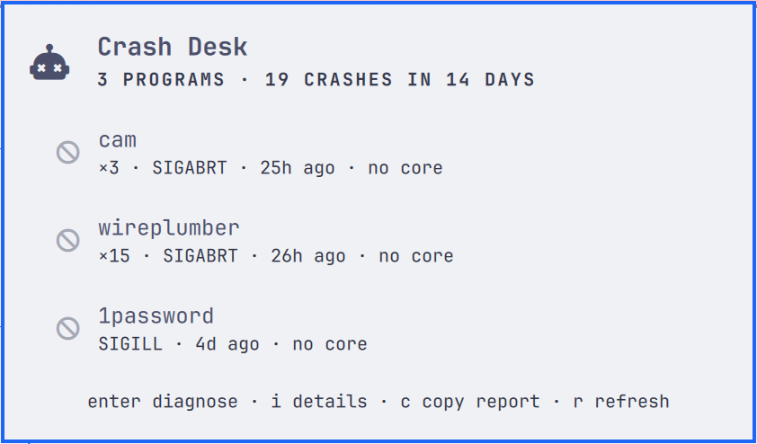

# Crash Desk

A history of what crashed on this machine, grouped by program, with a one-key handoff to your coding agent.



Omarchy already tells you when something crashes — once, in a toast that is gone if you weren't looking. Crash Desk
is the part that remembers: it reads systemd-coredump's history, folds crash loops into one row per program, and
runs the same `omarchy-agent-crash` diagnosis the toast offers, whenever you get around to it.

## Features

- Bar icon appears only when something has crashed since you last looked (count in the bar's urgent color).
  Nothing new, nothing in your bar.
- Panel lists each program: how many times, which signals, how long ago, and whether a core file was saved.
- `enter` diagnoses with your default agent, starting from the newest crash that still has a core — without a core
  there is no backtrace to read.
- `i` opens `coredumpctl info` for that crash; `c` copies a plain-text report ready to paste into an issue.
- Only your own crashes by default; system daemons are a sysadmin's problem.

## Interactions

| Where | Input | Action |
|---|---|---|
| Bar | left click | open panel (closing it marks everything seen) |
| Bar | right click | mark seen without opening |
| Bar | middle click | refresh |
| Panel | `j` / `k` / arrows | move cursor |
| Panel | `enter` / click | diagnose with your default agent |
| Panel | `i` | `coredumpctl info` in a terminal |
| Panel | `c` | copy report |
| Panel | `r` | refresh |

## Install

```bash
omarchy plugin add https://github.com/cgranier/omarchy-crash-desk.git --enable
```

Requires `systemd-coredump` (`coredumpctl`) and `wl-copy`. Diagnosis needs a default agent (`omarchy-default-agent`).

On first run your existing history counts as new, so the icon shows up once and you can find it; open and close the
panel to clear it. With `alwaysShow` off and nothing new, open it with
`omarchy-shell shell toggle cgranier.crashdesk '{}'`.

## Settings

`omarchy bar set cgranier.crashdesk <key> <value> [--json]`

| Key | Default | Meaning |
|---|---|---|
| `days` | `14` | How far back to look. |
| `refreshIntervalSec` | `60` | Poll interval. |
| `alwaysShow` | `false` | Keep the icon in the bar even with nothing new. |
| `allUsers` | `false` | Include crashes from other users and system daemons, when readable. |

The "seen" marker lives in `~/.local/state/omarchy-crashdesk/seen.json`.

## IPC

```bash
omarchy-shell cgranier.crashdesk status     # "3 programs · 19 crashes in 14 days"
omarchy-shell cgranier.crashdesk state      # JSON: crashes, programs, fresh, agent
omarchy-shell cgranier.crashdesk markSeen
```

## Development

```
manifest.json   plugin declaration + settings schema
Panel.qml       bar button + popup (entry point)
Service.qml     coredumpctl polling, seen state, actions
Model.js        pure logic: parsing, grouping, report text
tests/          node tests + synthetic fixture
```

`node tests/model.test.js` · `omarchy plugin validate .`

## License

MIT
